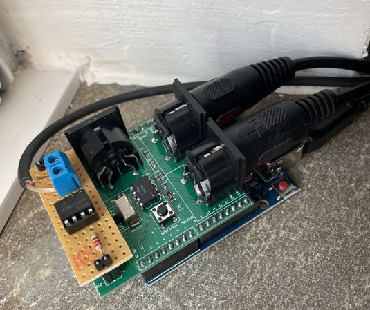

# organino

## Introduction

By using an Arduino with a (random) MIDI shield, I built a very simple MIDI
controller enhancing the functions of my Viscount D9E drawbar organ expander.

That's it.
Upload the code, plug it in between your MIDI input device and expander and
you're ready to go!

### Features

- **Sustain**: The organ expander does not react to any pedal events, i.e. does
not "hold" the keys. The Arduino keeps track of all played notes and keeps them
on as long as the sustain pedal is pressed.
- **Rotary slow/fast**: I hijacked the portamento pedal for switching the rotary
speed of the organ. As this happens fairly often, I don't want to have to
reach for the physical buttons each time to do so. Thus, on each portamento
event, the Arduino turns on a digital output, triggering an optocoupler which is
directly connected to the expander and switches the speed.

> The current setup perfectly fits my needs; feel free to adapt/extend the
> software and the attached circuit as you like.



## Development

### A note on versioning

This sketch utilizes (of course!) [Semantic Versioning](https://semver.org/). A
macro constant `GIT_VERSION` is expected to be defined and will be sent as SysEx
message at program start-up. As there is no generalized solution - *and that's a
shame!* - to fetch VCS version information at build time, providing this
information depends on your own individual workflow. Check out
[git-describe-arduino](https://github.com/fabianoriccardi/git-describe-arduino)
for a sophisticated workaround.

However, the sketch will also run without any version information and
automatically fall back to the compile date and time in that case.

### Linting

```sh
python -m venv venv
source ./venv/bin/activate
pip install --upgrade cpplint

cpplint --recursive --extensions=ino,c,cpp,h,hpp ./
`````
